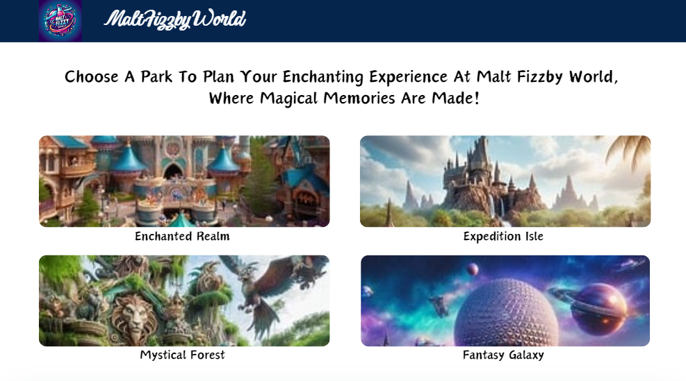

# Malt Fizzby Theme Parks Accessibility - Frontend 

This is the front-end component for the Malt Fizzby World Theme Parks Accessibility App, a full-stack web application designed to provide detailed information related to Malt Fizzby World parks, attractions, and accessibility features. It aims to assist visitors with disabilities or special needs in accessing detailed park and attraction information, including general accessibility details, interactive maps, and attraction descriptions. Future updates aim to enhance the park experience by offering personalized accessibility guides and resources. 


## Disclaimer:

Use of Disney Trademarks and Copyrighted Material

This project utilizes original content and design for the frontend application. The purpose is to demonstrate accessibility features and functionalities within a theme park context.

A (private) mockup design variation exists that incorporates trademarks and copyrighted material owned by The Walt Disney Company. This mockup design is not an officially endorsed or affiliated product and is for illustrative purposes only.

I acknowledge and respect the intellectual property rights of The Walt Disney Company. 





## Features (Current and Planned)

### Current Features

* Park Information: Users can view a list of all parks and get details of a specific park.
* Interactive Park Maps: Users can view an interactive map for each park to visualize its layout.
* Attraction Information: Users can view attractions in a specific park and get details of a specific attraction.
* Accessibility Information: Users can view general accessibility information for each park and detailed accessibility details for attractions.


### Planned Features

- **User Authentication**: Implement user registration and login for users to access full CRUD capabilities for managing their park plans.
- **CRUD Operations for Park Plans**: Allow users to create, view, update, and delete park plans or routes within their profile.
- **Route Optimization**: Implement a feature to calculate and create routes with the shortest distance between attractions in a park plan.
- **Break Areas Suggestion**: Include suggestions for break areas along the route to accommodate users with mobility issues who may need rest stops.


## Technologies Used 

* Angular 16.2.0 (Frontend library for building user interface)
* HTML
* CSS
* VS Code 


## Getting Started

### Prerequisites 

* Node.js and npm installed on your system. 
* Git (optional but recommended for version control)


### Installation 

1. Follow the instructions at the link below to clone and set up the backend: 
   * [Backend Repo](https://www.github.com/AyalaVirtual/ThemeParksAccessibilityAPI)

2. Clone the repository to your local machine:
   ```bash
   git clone https://github.com/AyalaVirtual/Malt-Fizzby-Theme-Parks-Accessibility-Frontend.git 

3. Navigate to the project directory: 

    ```bash
    cd malt-fizzby-theme-parks-accessibility-frontend
    ```

4. Install dependencies: 

    ```bash
    npm install 
    ```

    This will install all the required dependencies for the project. 

5. Run the development server:

    ```bash
    ng serve 
    ```

    This will start the Angular development server. Open your web browser and navigate to `http://localhost:4200` to access the application. 


## Links
* User Stories - https://docs.google.com/document/d/1mLiORi0NO0TcaMykAujzYsgFoyzLBELlFtPALw_Yj3c/edit?usp=sharing 

* HTTP requests/endpoints spreadsheet - https://docs.google.com/spreadsheets/d/1xIWKhaml3FHhzpcYROyoGMMztVnEql5rJnGOybD2k2M/edit?usp=sharing 


## Authors

:woman_technologist: Erica Ayala

* [LinkedIn](https://www.linkedin.com/in/ayalavirtual)

* [GitHub](https://www.github.com/AyalaVirtual)


